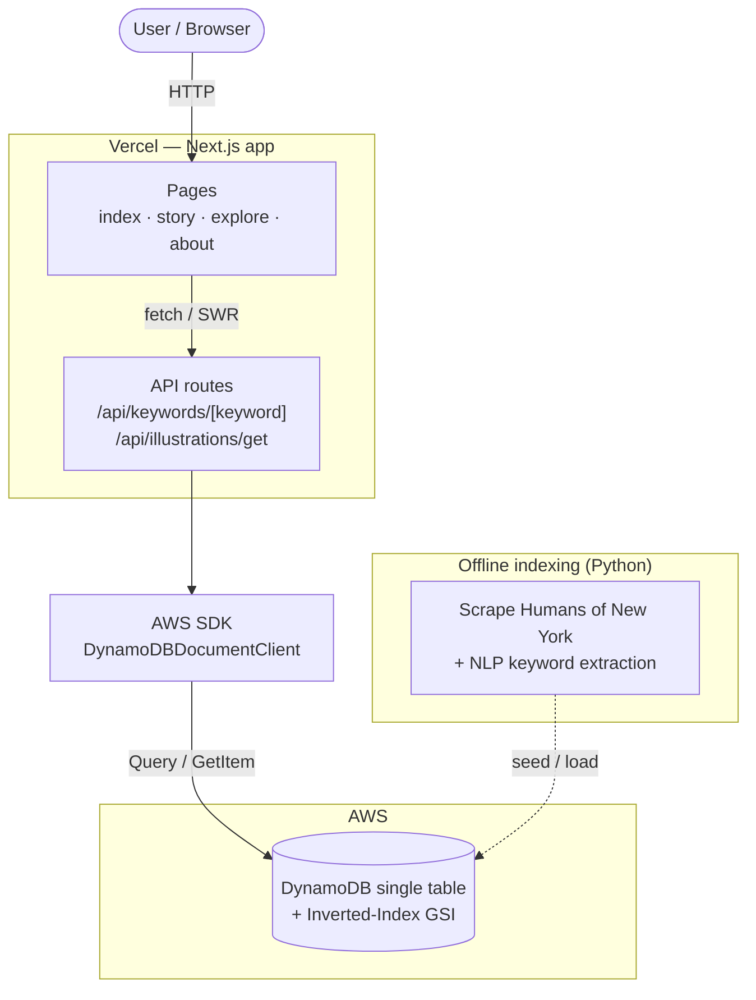

# Convey

> Discover compelling human interest stories to enhance your speaking and writing.

[](https://github.com/BradBissell/Convey/actions/workflows/ci.yml)
[](./LICENSE)
[](https://nextjs.org/)
[](https://illustration-finder-hony.vercel.app/)

**[🔎 Try it live →](https://illustration-finder-hony.vercel.app/)**


Convey indexes the 7,000+ human interest stories from [Humans of New York](https://www.humansofnewyork.com/) and makes them searchable by keyword, so communicators can find the right illustration in seconds instead of scrolling for hours.

## The problem

Anyone who communicates publicly — speakers, writers, teachers — knows that the right human interest story can make an idea land. But finding one is slow: sites like [People](https://people.com/human-interest/) and [Humans of New York](https://www.humansofnewyork.com/) host great material with no real search, so you're stuck scrolling and hoping a headline matches your point.

Convey solves this. Stories were scraped and run through NLP keyword extraction, then loaded into a DynamoDB table with an inverted index. You type a topic; Convey returns relevant stories ranked by match, with millisecond lookups.

## Features

- **Keyword search** over 7,000+ stories, backed by a DynamoDB inverted index.
- **Infinite scroll** with cursor-based pagination (DynamoDB `LastEvaluatedKey`) and client caching via SWR.
- **Story detail pages** — open any result in-app, with a link back to the original source.
- **Force-directed graph explorer** ([Sigma.js](https://www.sigmajs.org/) + [Graphology](https://graphology.github.io/)) to browse stories and keywords as a connected network.
- **Responsive UI** built with [Mantine](https://mantine.dev/).
- **Hardened API** — security headers (CSP, HSTS, anti-clickjacking), input validation, clamped page sizes, and no leaked error internals.

## Tech stack

| Layer | Choice |
|-------|--------|
| Framework | Next.js 14 (pages router), React 18, TypeScript (strict) |
| UI | Mantine, Emotion |
| Data fetching | SWR (incl. `useSWRInfinite`) |
| Backend | Next.js API routes (serverless on Vercel) |
| Database | AWS DynamoDB — single-table design + Global Secondary Index |
| Graph viz | Sigma.js + Graphology (ForceAtlas2) |
| Testing | Jest + React Testing Library (unit), Cypress (e2e) |
| Hosting | Vercel (frontend + API), CI via GitHub Actions |

## Architecture

Frontend and API are deployed together on Vercel; the API queries a single DynamoDB table whose inverted index allows fast lookups by either keyword or illustration.



### Data model

A single table stores both illustrations and keyword relationships, using composite keys and a Global Secondary Index ("Inverted-Index") that swaps the partition/sort keys:

- **Illustration → keywords:** `PK = Illustration#<snippet>`, `SK = Meta#<source>`
- **Keyword → illustrations (via GSI):** query `SK = Keyword#<keyword>` and `begins_with(PK, "Illustration#")`

This lets one table answer both "what is this story about?" and "what stories match this keyword?" with single-digit-millisecond queries, no joins.

## Getting started

Requires **Node 24** (see [`.nvmrc`](./.nvmrc)) and **Yarn**.

```bash
git clone https://github.com/BradBissell/Convey.git
cd Convey
nvm use            # or: nvm install 24
yarn install
cp .env.example .env.local   # then fill in your AWS values
yarn dev                     # http://localhost:3000
```

You'll need your own DynamoDB table; configure these in `.env.local`:

| Variable | Purpose |
|----------|---------|
| `ACCESS_KEY` / `SECRET_KEY` | AWS credentials (least-privilege: `dynamodb:Query` + `GetItem` on the table and its index) |
| `REGION` | AWS region of the table |
| `TABLE_NAME` | DynamoDB table name |

Build for production with `yarn build` and run with `yarn start`.

## Testing

```bash
yarn test          # Jest unit + component tests (run once)
yarn test:watch    # Jest in watch mode
yarn cypress       # Cypress end-to-end tests (app must be running)
```

CI runs lint, tests, and a production build on every push and pull request.

## Image hosting

For a self-contained demo, story thumbnails are bundled in `public/portraits`. For production you'd serve them from a CDN / object store instead: upload the folder (see [`scripts/upload-portraits.sh`](./scripts/upload-portraits.sh)) and set `NEXT_PUBLIC_IMAGE_BASE_URL` to the public base URL. The app reads that env var via [`lib/imageUrl.ts`](./lib/imageUrl.ts) — no code changes needed.

## License

[MIT](./LICENSE) © Brad Bissell. Story content belongs to [Humans of New York](https://www.humansofnewyork.com/) / Brandon Stanton; Convey links back to each original source.
